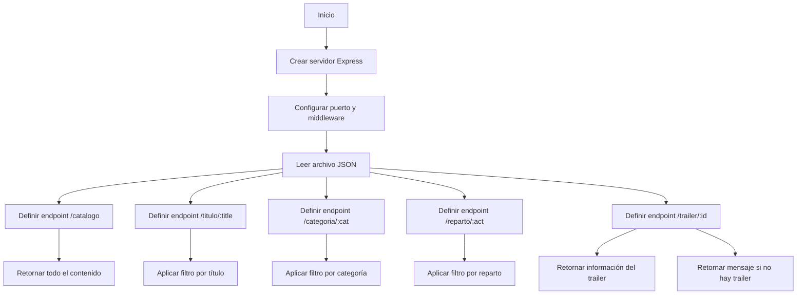
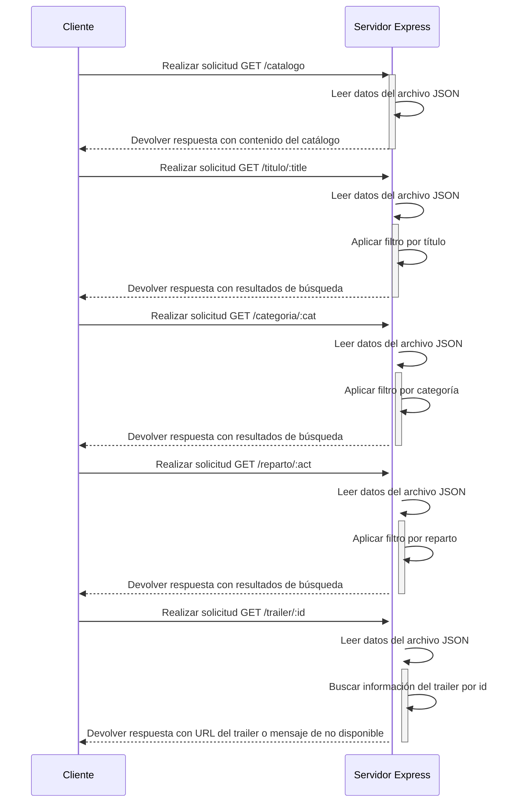

## Diagrama de Flujo
```
Un codigo de mermaid js de un diagrama de flujo de la preentrega1 de pelis
```
### Mermaid
```
graph TD
  A[Inicio] --> B[Crear servidor Express]
  B --> C[Configurar puerto y middleware]
  C --> D[Leer archivo JSON]
  D --> E[Definir endpoint /catalogo]
  D --> F[Definir endpoint /titulo/:title]
  D --> G[Definir endpoint /categoria/:cat]
  D --> H[Definir endpoint /reparto/:act]
  D --> I[Definir endpoint /trailer/:id]
  E --> J[Retornar todo el contenido]
  F --> K[Aplicar filtro por título]
  G --> L[Aplicar filtro por categoría]
  H --> M[Aplicar filtro por reparto]
  I --> N[Retornar información del trailer]
  I --> O[Retornar mensaje si no hay trailer]
```

## Diagrama de Secuencia
### Mermaid
```
sequenceDiagram
  participant Cliente
  participant Servidor Express

  Cliente->>+Servidor Express: Realizar solicitud GET /catalogo
  Servidor Express->>Servidor Express: Leer datos del archivo JSON
  Servidor Express-->>-Cliente: Devolver respuesta con contenido del catálogo

  Cliente->>+Servidor Express: Realizar solicitud GET /titulo/:title
  Servidor Express->>+Servidor Express: Leer datos del archivo JSON
  Servidor Express->>Servidor Express: Aplicar filtro por título
  Servidor Express-->>-Cliente: Devolver respuesta con resultados de búsqueda

  Cliente->>+Servidor Express: Realizar solicitud GET /categoria/:cat
  Servidor Express->>+Servidor Express: Leer datos del archivo JSON
  Servidor Express->>Servidor Express: Aplicar filtro por categoría
  Servidor Express-->>-Cliente: Devolver respuesta con resultados de búsqueda

  Cliente->>+Servidor Express: Realizar solicitud GET /reparto/:act
  Servidor Express->>+Servidor Express: Leer datos del archivo JSON
  Servidor Express->>Servidor Express: Aplicar filtro por reparto
  Servidor Express-->>-Cliente: Devolver respuesta con resultados de búsqueda

  Cliente->>+Servidor Express: Realizar solicitud GET /trailer/:id
  Servidor Express->>+Servidor Express: Leer datos del archivo JSON
  Servidor Express->>Servidor Express: Buscar información del trailer por id
  Servidor Express-->>-Cliente: Devolver respuesta con URL del trailer o mensaje de no disponible

```

```
Este diagrama de secuencia representa las interacciones entre el cliente y el servidor Express para
cada uno de los endpoints mencionados en el flujo original. Cada solicitud del cliente al servidor
se procesa en el servidor Express y se devuelve una respuesta correspondiente al resultado de la consulta.
```
