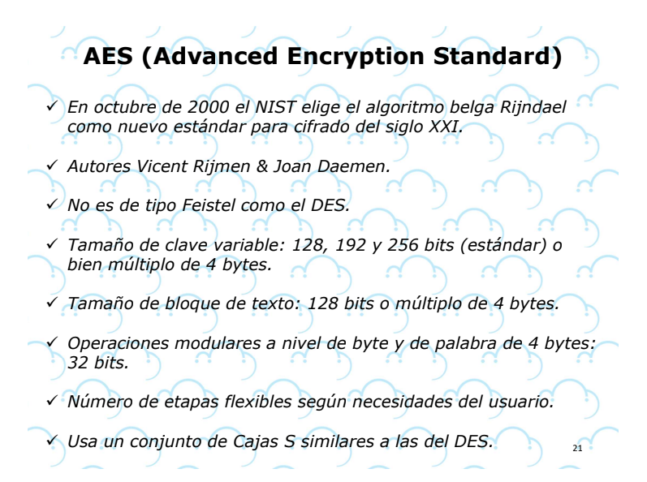

### Sobre la tarea de la clase 14:
En el contexto de la informática y la tecnología, "PUT" y "PATCH" son términos relacionados con los métodos de solicitud HTTP utilizados para interactuar con recursos en servidores web. 
Estos métodos son parte del conjunto de métodos HTTP estándar que permiten a los clientes (como navegadores web o aplicaciones) comunicarse con servidores para obtener, actualizar o eliminar información. Aquí hay una explicación de cada uno:

PUT (Poner): El método HTTP PUT se utiliza para actualizar o crear un recurso en el servidor. Cuando se realiza una solicitud PUT, el cliente envía una representación completa del recurso actualizado al servidor. Si el recurso ya existe en el servidor, se reemplaza con la nueva representación proporcionada. Si el recurso no existe, el servidor puede crearlo utilizando la representación proporcionada en la solicitud PUT.

PATCH (Parche): El método HTTP PATCH se utiliza para realizar modificaciones parciales en un recurso en el servidor. A diferencia de PUT, que envía una representación completa del recurso, PATCH solo envía los cambios necesarios para actualizar el recurso. Esto es útil cuando solo se desean realizar pequeñas modificaciones en un recurso sin tener que enviar toda la información.

En resumen:
PUT se utiliza para actualizar completamente un recurso o crear uno nuevo, enviando una representación completa del recurso en la solicitud.
PATCH se utiliza para aplicar cambios parciales a un recurso existente, enviando solo los cambios necesarios en la solicitud.

Ambos métodos son útiles en diferentes escenarios, y la elección entre PUT y PATCH depende de la naturaleza de la operación que se desea realizar en el recurso. Es importante notar que la implementación y el comportamiento exacto de estos métodos pueden variar según el servidor y la aplicación web en cuestión

### Contenido Extra Clase 15:

### encryption
https://preyproject.com/es/blog/tipos-de-cifrado-simetrico-o-asimetrico-rsa-o-aes

https://www.boxcryptor.com/es/encryption/ 

https://ciberseguridad.com/guias/prevencion-proteccion/autenticacion-jwt/ 

### JSON WEB TOKEN
https://jwt.io/

## Clave secreta

# Cifrado simentrico

## AES

------------------------------------------------------------------------------------------
## Clave publico

# Cifrado asimentrico

## RSA

