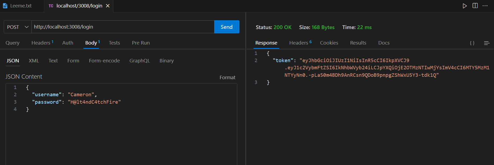

Se debe crear un archivo .env, con los siguientes datos:
La clave definida se puede cambiar por la que sea.
SECRET_KEY=miClaveSecretaQueNadieSabra
PORT=3008

Se deben instalar todas las dependencias necesarias, ejecutando:

/> npm install

# Probar en postman o thunder client o insomnia
## logearse
elegir post : http://localhost:3008/login
poner en el body:

{
  "username": "Cameron",
  "password": "H@lt-And_Catch?F1re"
}

copian el token y para probar la rutaprotegida

http://localhost:3008/rutaprotegida

Authorization y pegan el token obtenido del login
