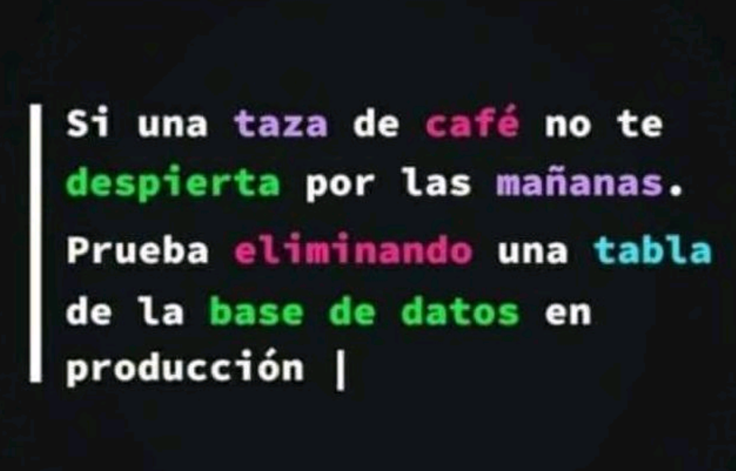

Crearemos un proyecto Node.js nuevo al cual llamaremos
NodeJS + MongoDB. En este, una vez inicializado,
instalamos las siguientes dependencias:
    ● Express JS
    ● dotenv
Luego, creamos una carpeta llamada src, dentro de
ella un archivo llamado mongodb.js y, f

npm init --y
npm install -D nodemon 
npm install express dotenv mongodb --save

RECORDAR PONER EN PACKAGE.JSON
 "start":"nodemon app.js"

Y EN EL .env
PORT=3008
MONGODB_URLSTRING=mongodb+srv://<usuario_mongodb_atlas>:<password_mongodb_atlas>@<database>.uya7fjp.mongodb.net/?retryWrites=true&w=majority
URL O URI
