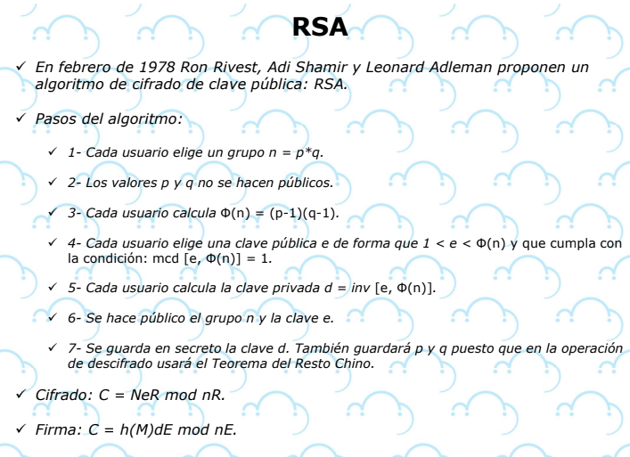

### encryption
https://preyproject.com/es/blog/tipos-de-cifrado-simetrico-o-asimetrico-rsa-o-aes

https://www.boxcryptor.com/es/encryption/ 

### JSON WEB TOKEN
https://jwt.io/
# Cifrado simentrico

## Clave secreta

## AES

# Cifrado asimentrico

## Clave publico

## RSA
