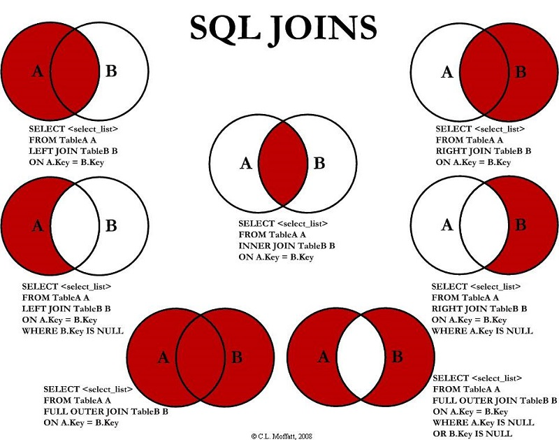
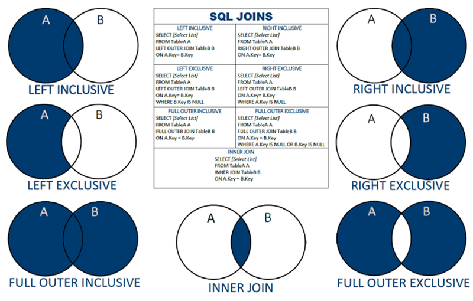
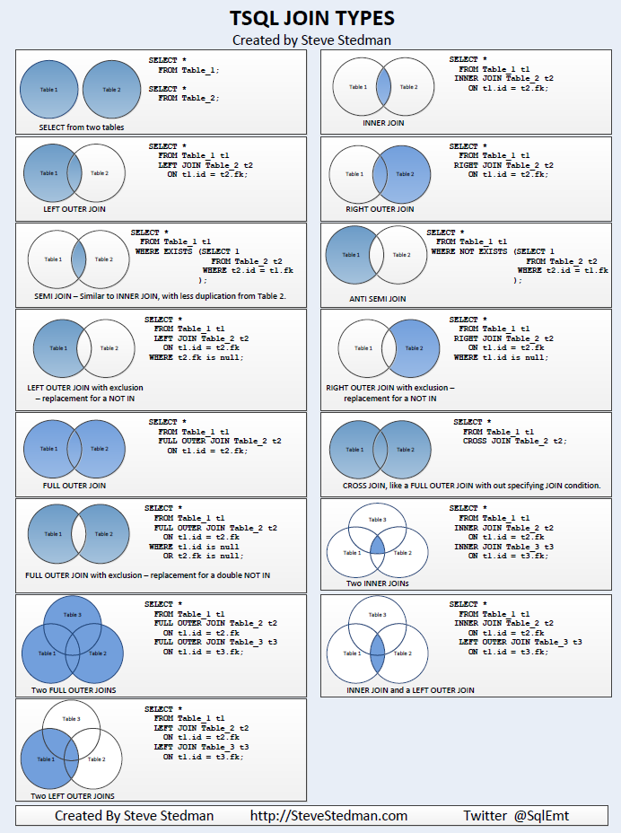

JOIN es una operación utilizada en lenguajes de consulta de bases de datos para combinar datos de dos o más tablas basándose en una relación común entre ellas. El JOIN se utiliza para recuperar datos relacionados de múltiples tablas en una sola consulta.

Existen diferentes tipos de JOIN, entre los más comunes se encuentran:

- INNER JOIN: Devuelve solo los registros que tienen una coincidencia en ambas tablas.
- LEFT JOIN: Devuelve todos los registros de la tabla izquierda y los registros coincidentes de la tabla derecha.
- RIGHT JOIN: Devuelve todos los registros de la tabla derecha y los registros coincidentes de la tabla izquierda.
- FULL JOIN: Devuelve todos los registros de ambas tablas, incluso si no hay coincidencias.

Aquí tienes algunos enlaces que te pueden ayudar a comprender mejor el concepto de JOIN y cómo se utiliza en diferentes bases de datos:

Documentación oficial de MySQL sobre JOIN: https://dev.mysql.com/doc/refman/8.0/en/join.html