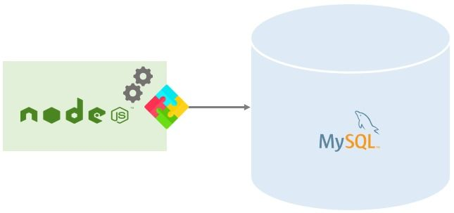
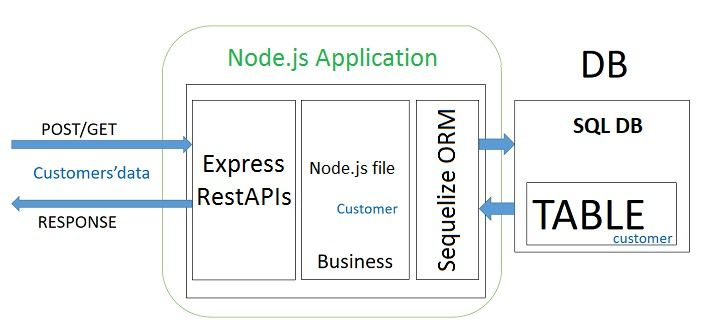
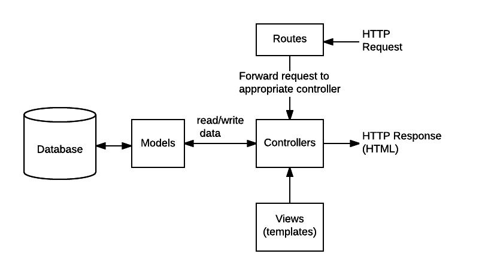

# Cómo crear la conexión MySQL con el nodo JS usando Sequelize y Express

## Conexión MySQL con Node JS:
REST (Representational State Transfer) ayuda a determinar cómo aparece la API, mientras que CRUD (Crear, Leer, Actualizar y Eliminar) es simplemente un acrónimo de cómo funcionar con los datos almacenados. Con respecto a la API REST, CRUD es la forma estándar de verbos de acción HTTP. Cuando comprenda la API en detalle, puede comprender las formas de utilizar los nodos js con MySQL.



Para crear REST API en un entorno node.js, estos son los pasos a seguir:

1. Abra un servidor web Express 
2. Agregue los datos de configuración para una base de datos MySQL existente
3. Abre una secuela
4. En secuelas, crea un modelo tutorial
5. Escribe el controlador 
6. Defina todas las rutas para manejar cada función CRUD
7. Cartero Abierto
8. Pruebe la API REST CRUD
   
Después de estos pasos, se completa la conexión MySQL con el nodo js.

## Herramientas necesarias para construir REST CRUD API:
Se pueden implementar muchas herramientas disponibles para construir la API REST CRUD de manera efectiva. Algunas de las herramientas más utilizadas son las siguientes:

1. Sequelize: Una secuela es un ORM basado en promesas para Node.js que incorpora aplicaciones de lectura robustas, relaciones de transacción, soporte y carga. Sequelize permite a los usuarios administrar bases de datos SQL más grandes. También hace que MySQL con node.js sea viable.




1. Expreso: Express es un marco de aplicación web para node.js. Se considera un de-facto para el marco node.js, principalmente porque es de código abierto, gratuito y minimalista.

2. MySQL: Es un RDBMS (sistema de gestión de bases de datos relacionales). MySQL está respaldado por Oracle Corporation y está disponible de forma gratuita. Además, el código fuente en MySQL se puede personalizar según sus requisitos.

### Pros de secuelas:
- Sequelize reduce la complejidad al eliminar las sutiles disparidades entre las diferentes implementaciones SQL.
- También proporciona un middleware incorporado que permite la personalización individual para eliminar los errores en cada campo.
- Sequelize incorpora una biblioteca construida por promesa que permite al usuario administrar mejor las excepciones y los resultados imprevistos.
- También cuestiona todas las funciones de unión complicadas, ayuda al usuario a aprender sobre la conexión 'objects'.
- Por último, la base de datos de sincronización en un modelo modificado alterará o creará automáticamente tablas según los requisitos de los usuarios.
  
### Contras de secuelas:
- NoSQL no admite secuelas, ya que incluye algunos problemas inexplicables cuando se requieren conexiones adicionales a la base de datos.
- Sequelize Cloud genera consultas complicadas.


## Creación de una aplicación node.js:
Al crear una aplicación Node JS, debe comprender los tres componentes que vienen con ella.

1. Importar los módulos requeridos - Para cargar los módulos Node JS, debe importar las directivas necesarias.

2. Crear un servidor - Si desea atender su solicitud de usuarios, debe crear un servidor.

3. Lectura de la respuesta de solicitud y devolución - El servidor que ha creado leerá la solicitud HTTP y responderá a cambio.

Cuando conoces estos componentes, se hace más fácil entender el concepto de node.js usando MySQL. Para crear una aplicación node.js, el usuario debe seguir estos pasos:

1. Crear una carpeta
```
$ mkdir nodejs-express-Sequelize-mysql
$ cd nodejs-express-Sequelize-mysql
```
2. Abrir un archivo json

3. Inicialización de la aplicación node.js
```
npm init --y
```

4. Instalación de los módulos body-parser, express, secuelas y mysql2

5. Ejecución del comando
```
npm install express sequelize mysql2 body-parser cors --save 
```
## Creación de una Base de Datos de Muestra
Como parte de los requisitos previos, instaló y configuró MySQL, que incluía crear un usuario. Ahora creará una base de datos vacía.

Para hacer eso, primero, debe iniciar sesión en su instancia de MySQL. Si está ejecutando de forma remota, puede usar su herramienta preferida. Si está utilizando una instancia MySQL que se ejecuta localmente, puede usar el siguiente comando, reemplazando tu_nombre de usuariocon su nombre de usuario MySQL:

`mysql -u your_username -p`

-u es el nombre de usuario y el -p la opción se pasa si la cuenta está asegurada con una contraseña.

El servidor MySQL le pedirá la contraseña de su base de datos. Escriba su contraseña y presione ENTER.

Una vez que haya iniciado sesión, cree una base de datos llamada hello_world_db usando el siguiente comando:

`CREATE DATABASE hello_world_db;`

Para verificar si ha creado la base de datos correctamente, puede usar este comando:

`SHOW DATABASES;`

Su salida será similar a esto:
```
+--------------------+
|      Database      |
+--------------------+
| hello_world_db     |
| information_schema |
| mysql              |
| performance_schema |
| sys                |
+--------------------+
```
Después de crear la base de datos de muestra, desconecte del servidor MySQL:

`mysql> QUIT`

## Configuración del servidor web express.js:
Los siguientes son los pasos para configurar el nodo js con el servidor web express:
co
1.  En la carpeta raíz, puede crear un nuevo archivo server.js.
   > nota si desean crear por terminal usar 
   ```echo > server.js```

2.  Importe los cors, el body-parser y los módulos express

Body-parser analizará la solicitud para la creación del objeto req.body. Express ayudará a construir las API REST, mientras que los cors proporcionarán middleware expreso. Esto ofrecerá varias opciones a los cors.

3. Crea una aplicación express


4. Use() para agregar cors y middlewares de body-parser.

El origen se establece como 'http://localhost:3000'

5. Defina una ruta GET: asegúrese de que la ruta sea simple y de fácil acceso.

6. Sintonice el puerto 8080 para la solicitud entrante.

7. Ejecute la aplicación con el comando: node server.js

8. Abra un navegador web

9. Ir al "http:// localhost:3000/". Se mostrará el mensaje especificado.

## Configuración de la base de datos MySQL con secuela:
Configurar la base de datos MySQL con secuelas es un aspecto muy crucial. Ayuda en el desarrollo y configuración. La combinación de node.js y secuelas funciona en función de la configuración. Aquí están los siguientes pasos a realizar:

1. Abra el Explorador de Windows.
2. Navegue a la carpeta de la aplicación.
3. Dentro de la carpeta de la aplicación, puede crear una carpeta de configuración como un archivo db.config.js en:
```
module.exports = {
    HOST: "localhost",
    USER: "root",
    PASSWORD: "12345678",
    DB: "testdb",
    dialect: "mysql", 
    pool: {
        max: 5,
        min: 0,
        acquire: 30000,
        idle: 10000
    }
};
```
Los primeros cinco parámetros están destinados principalmente a MySQL. El parámetro pool es opcional y se implementará en la configuración del pool de conexión de secuelas. Los parámetros utilizados se explican a continuación:

- Max - número máximo de conexiones permitidas en una base
- Min - número mínimo de conexiones permitidas en una base
- Idle  - tiempo máximo en milisegundos que puede mantenerse inactivo antes del lanzamiento
- Acquire - tiempo máximo en milisegundos que el grupo busca para hacer la conexión, justo antes de que aparezca un mensaje de error