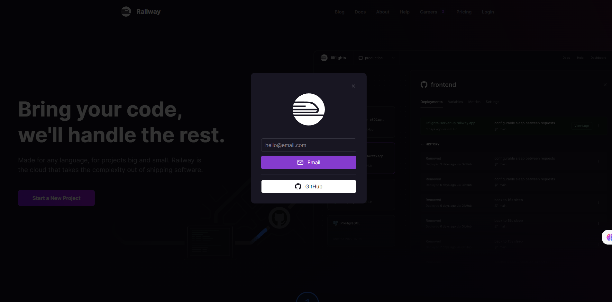
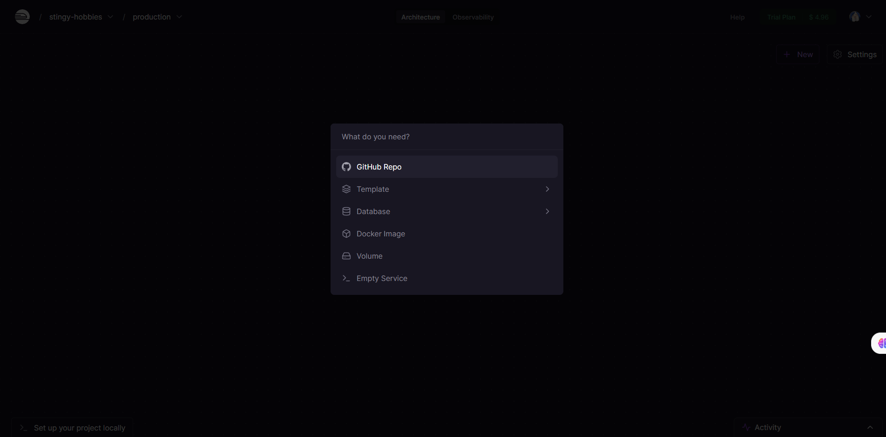
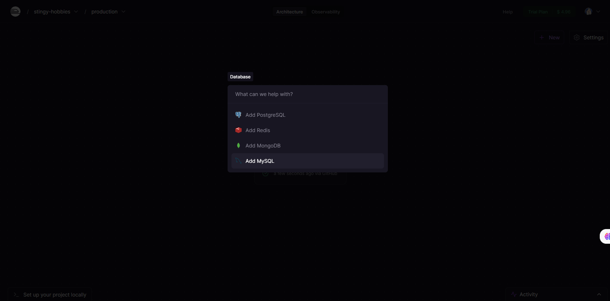
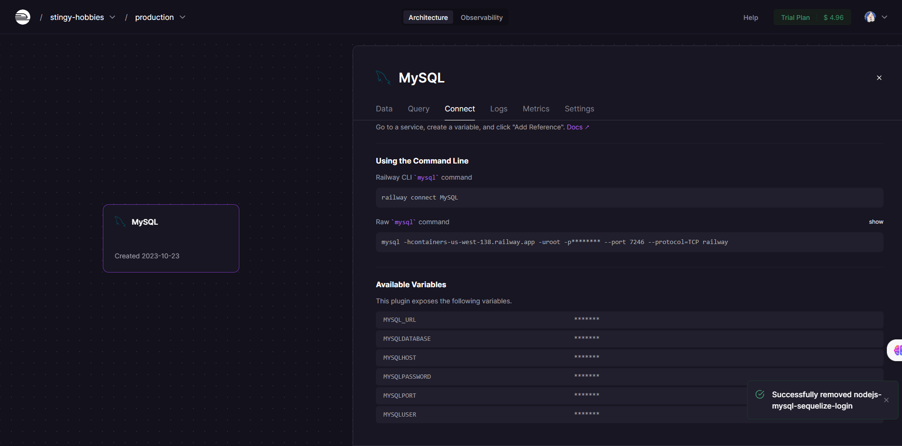
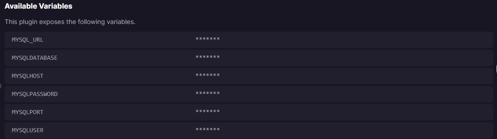
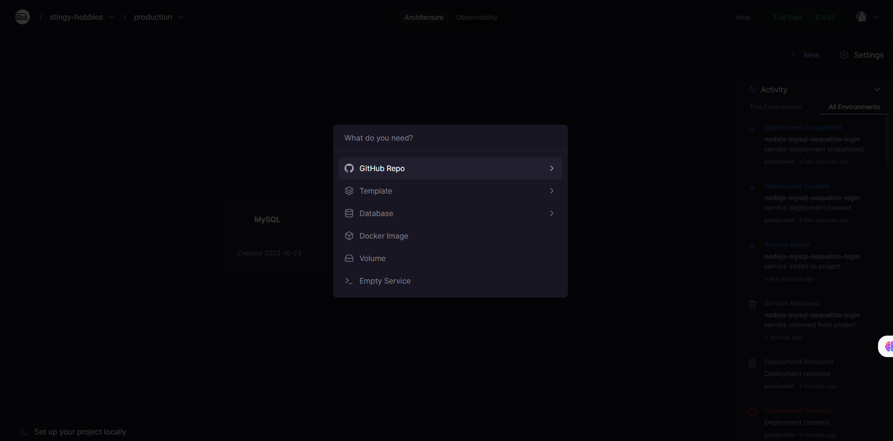

# DEPLOYAR UNA APP CON FINAL FELIZ
## 1) Hacerte una cuenta en RAILWAY
https://railway.app/ 

## 2) Tener el proyecto en un repositorio

Usare: https://github.com/jeanmunoz23/nodejs-mysql-sequelize-login 

## 3) Buscamos nuestro repositorio
Lo seleccionamos

## 4)  Creamos la database 

En nuestro caso mysql

Al seleccionarla se nos genera una instancia en donde podemos acceder a coneccion y ver los datos para nuestra app

cuyos datos seran utiles al deployar nuestra app y generar las variables de entorno 

## 5)  Creamos la instancia de nuestra app 

es decir buscamos agregar nuestro proyecto

## 6) Configuramos variables de entorno

## 7) Ver los para verificar si deployamos

