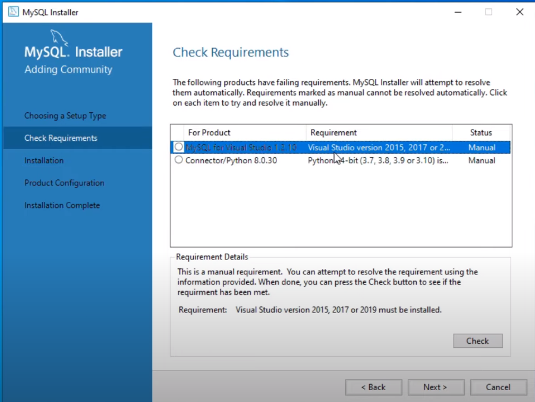
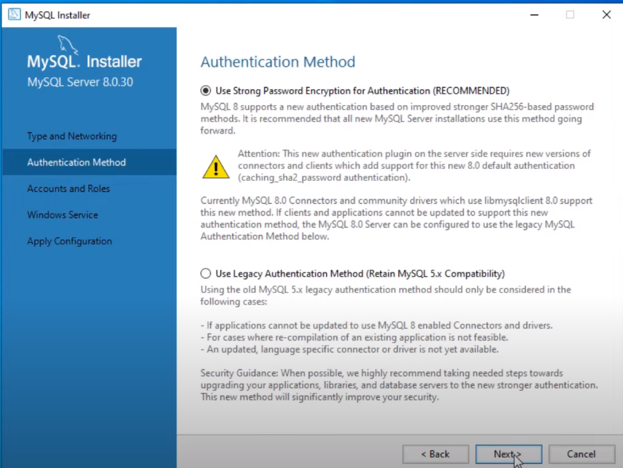
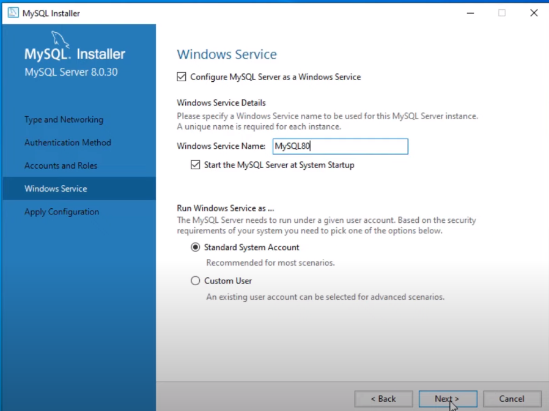

Ingresar a [mysql page oficial](https://dev.mysql.com/downloads/installer/)
Descargar paquete 

Pasos al instalar 

1 - 

1.1 - 

1.2 - 

2 - 

3 - 

4 - 

5 - 

6 - 

7 - 

8 - 

9 -  

10 - 

11 - 

12 - 

13 - 

14 - 

15 - 

16 - 

17 - 